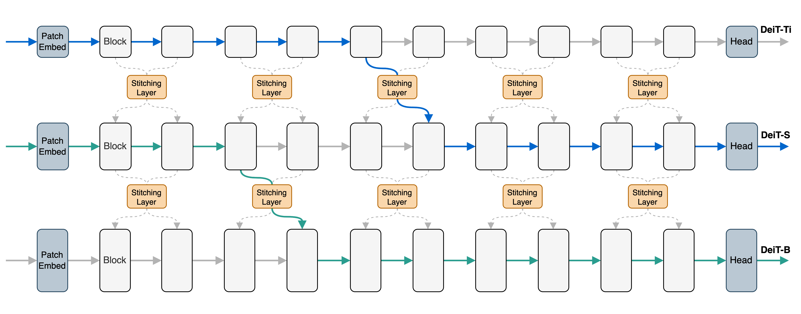

# Stitchable Neural Networks 🪡 (CVPR 2023 Highlight)

[](https://opensource.org/licenses/Apache-2.0) 
<a href="https://pytorch.org/get-started/locally/"></a>


This is the official PyTorch implementation of [Stitchable Neural Networks](https://arxiv.org/abs/2302.06586).


By [Zizheng Pan](https://scholar.google.com.au/citations?user=w_VMopoAAAAJ&hl=en), [Jianfei Cai](https://scholar.google.com/citations?user=N6czCoUAAAAJ&hl=en), and [Bohan Zhuang](https://scholar.google.com.au/citations?user=DFuDBBwAAAAJ).


## News

- 28/03/2023. Code for stitching LeViTs has been released. 
- 27/03/2023. We release the code and checkpoints for stitching ResNets and Swin Transformers.
- 22/03/2023. SN-Net was selected as a highlight at CVPR 2023!🔥
- 02/03/2023. We release the source code! Any issues are welcomed!
- 28/02/2023. SN-Net was accepted by CVPR 2023! 🎉🎉🎉


## A Gentle Introduction



Stitchable Neural Network (SN-Net) is a novel scalable and efficient framework for model deployment which cheaply produces numerous networks with different complexity and performance trade-offs given a family of pretrained neural networks, which we call anchors. Specifically, SN-Net splits the anchors across the blocks/layers and then stitches them together with simple stitching layers to map the activations from one anchor to another.

With only a few epochs of training, SN-Net effectively interpolates between the performance of anchors with varying scales. At runtime, SN-Net can instantly adapt to dynamic resource constraints by switching the stitching positions. 


## Getting Started

SN-Net is a general framework. However, as different model families are trained differently, we use their own code for stitching experiments. In this repo, we provide examples for several model families, such as plain ViTs, hierarchical ViTs, CNNs, CNN-ViT, and lightweight ViTs.

To use our repo, we suggest creating a Python virtual environment.

```bash
conda create -n snnet python=3.9
pip install torch==1.12.1+cu113 torchvision==0.13.1+cu113 torchaudio==0.12.1 --extra-index-url https://download.pytorch.org/whl/cu113
pip install fvcore
pip install timm==0.6.12
```

Next, you can feel free to experiment with different settings.

For experiments with plain ViTs, please refer to [stitching_deit](./stitching_deit).

For experiments with hierarchical ViTs, please refer to [stitching_swin](./stitching_swin).

For experiments with CNNs and CNN-ViT, please refer to [stitching_resnet_swin](./stitching_resnet_swin).

For experiments with lightweight ViTs, please refer to [stitching_levit](./stitching_levit).


## Best Practice for Extension

Please feel free to extend SN-Net into other model familiy. The following tips may help your experiments.

### For Better Stitching

1. For paired stitching (equal depth) such as on plain ViTs, using a small sliding window for stitching usually achieves a smoother performance curve.
2. For unpaired stitching (unequal depth) such as on hierarchical ViTs, split the architecture into different stages and stitch within the same stage.
3. Note that many existing models allocate most blocks/layers into the 3rd stage, thus stitching at the 3rd stage can help to obtain more stitches. 
4. Remember to initialize your stitching layers. A few samples can be enough.


### For Better Training

1. Uniformly decreasing the learning rate (the training time LR) by 10x can serve as a good starting point. See our settings in DeiT-based experiments.
2. If the above is not good, try to decrease the learning rate for anchors while using a relatively larger learning rate for stitching layers. See our Swin-based experiments.
3. Training with more epochs (e.g., 100) can be better, but it also comes at a higher computational cost.


## Citation

If you use SN-Net in your research, please consider the following BibTeX entry and giving us a star🌟!

```BibTeX
@inproceedings{pan2023snnet,
  title={Stitchable Neural Networks},
  author={Pan, Zizheng and Cai, Jianfei and Zhuang, Bohan},
  booktitle={CVPR},
  year={2023}
}
```


## Acknowledgement

This implementation is built upon [DeiT](https://github.com/facebookresearch/deit) and [Swin](https://github.com/microsoft/Swin-Transformer). We thank the authors for their released code.


## License

This repository is released under the Apache 2.0 license as found in the [LICENSE](https://github.com/ziplab/SN-Net/blob/main/LICENSE) file.

