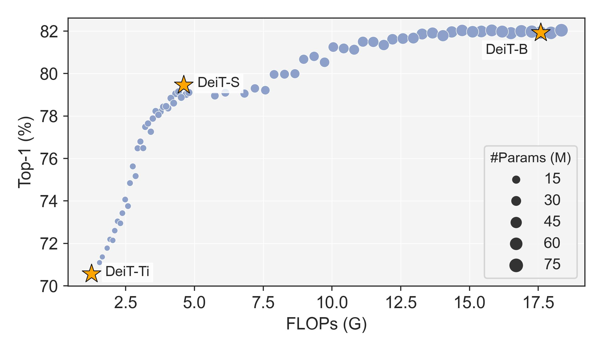

# Stitchable Neural Networks 🪡

This directory contains the training and evaluation scripts for stitching DeiTs.

## Requirements

### Prepare Python Environment

* PyTorch 1.10.1+
* CUDA 11.1+
* timm 0.6.12
* fvcore 0.1.5


### Prepare Pretrained Weights

Download pretrained DeiT-Ti, DeiT-S, and DeiT-B at [here](https://github.com/facebookresearch/deit/blob/main/README_deit.md). Then, put them under the `pretrained` directory. The following commands can be helpful.

```bash
cd pretrained
wget https://dl.fbaipublicfiles.com/deit/deit_tiny_patch16_224-a1311bcf.pth
wget https://dl.fbaipublicfiles.com/deit/deit_small_patch16_224-cd65a155.pth
wget https://dl.fbaipublicfiles.com/deit/deit_base_patch16_224-b5f2ef4d.pth
```


## Training

Inside this directory, you can use the following commands to replicate our results on ImageNet.

```bash
python -m torch.distributed.launch --nproc_per_node=8 \
      --master_port 1234 \
      --use_env main.py \
      --config config/deit_stitching.json \
      --dist-eval
```

Make sure you update the ImageNet path in `config/deit_stitching.json`. By default, we train DeiT-based SN-Net with 50 epochs. 


## Evaluation

You can download our trained weights from [here](https://github.com/ziplab/SN-Net/releases/download/v1.0/snnet_deit.pth). Next,


```bash
python -m torch.distributed.launch --nproc_per_node=8 \
      --master_port 1234 \
      --use_env main.py \
      --config config/deit_stitching.json \
      --dist-eval --eval --resume [path/to/snnet_deit.pth]
```

After evaluation, you can find a `stitches_res.txt` under the `outputs/` directory which contains the results for all stitches.

## Selective Inference

One advantage of SN-Net is that it can instantly switch network topology at runtime after training. For example,

```python
import torch

x = torch.randn(224, 224, 3)

# testing with stitch id 24
model.reset_stitch_id(24)
out = model(x)
# FLOPs = 2.76G, ImageNet-1K Top-1 acc = 75.63%

# testing with stitch id 56
model.reset_stitch_id(56)
out = model(x)
# FLOPs = 10.05G, ImageNet-1K Top-1 acc = 81.25%
```


## Hyperparameters in SN-Net

Feel free to tune the hyperparameters in SN-Net. For example,

- `fulltune`: fully finetune the anchors and the stitching layers, otherwise the anchors are freezed.
- `ls_init`: initialize the stitching layers by the least squares method.
- `nearest_stitching`:  limit a stitch to connect with a pair of anchors that have the nearest model complexity/performance.
- `stitch_stride`: sliding window stride for stitching.
- `stitch_kernel_size`: sliding window size for stitching.
- `stitch_init_bs`: the number of samples for initializing the stitching layers.

A concrete example is shown in `config/deit_stitching.json`, where it contains our default setting.


## Results

Our evaluation results of DeiT-based SN-Net on ImageNet can be found at `results/stitches_res.txt` . We also provide a script to visualize the FLOPs-accuracy curve of stitches, as shown in Figure 6 of our paper.

```bash
python visualize_stitches.py
```

You should see a figure as below.




## Acknowledgement

This implementation is mainly based on [DeiT](https://github.com/facebookresearch/deit). We thank the authors for their released code.
